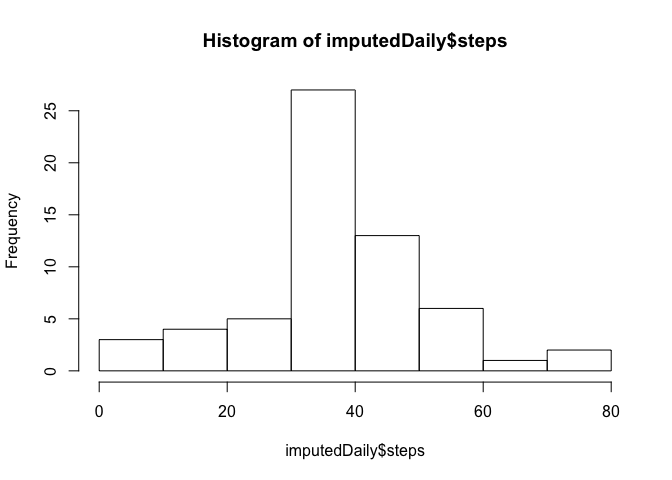

# Reproducible Research: Peer Assessment 1


```r
library(dplyr)
```

```
## 
## Attaching package: 'dplyr'
## 
## The following object is masked from 'package:stats':
## 
##     filter
## 
## The following objects are masked from 'package:base':
## 
##     intersect, setdiff, setequal, union
```

```r
library(ggplot2)
library(lattice)
```

# Loading and preprocessing the data

```r
download.file("https://d396qusza40orc.cloudfront.net/repdata%2Fdata%2Factivity.zip", destfile="activity.zip", method="curl")
unzip(zipfile = "activity.zip")
```


```r
data <- read.csv("activity.csv", stringsAsFactors=FALSE)
data$date <- as.Date(data$date, "%Y-%m-%d")
```

# What is mean total number of steps taken per day?

```r
daily <- data[,c("steps", "date")]
daily <- aggregate(steps ~ date, daily, FUN=mean)
hist(daily$steps, xlab="Steps", main = "Histogram of number of steps per day")
```

 

## Mean value

```r
mean(daily$steps, na.rm = TRUE)
```

```
## [1] 37.3826
```

## Median value

```r
median(daily$steps, na.rm = TRUE)
```

```
## [1] 37.37847
```

# What is the average daily activity pattern?

```r
byInterval <- data[,c("steps", "interval")]
byInterval <- aggregate(steps ~ interval, byInterval, FUN=mean)
plot(byInterval, type="l")
```

 

## Which 5-minute interval, on average across all the days in the dataset, contains the maximum number of steps?

```r
maxRow <- which.max(byInterval$steps)
byInterval[maxRow,"interval"]
```

```
## [1] 835
```

# Imputing missing values
## Number of missing values

```r
sum(!complete.cases(data))
```

```
## [1] 2304
```

## Impute the values
Basically you can put anything into my_impute function. 
For illustration purposes I've picked the simplest possible thing - a constant :)

```r
my_impute <- function(date, interval) {
  return(36);
}
imputed <- data
imputed$steps <- ifelse(is.na(data$steps), my_impute(imputed$date, imputed$interval), data$steps)
```

## Let's see how the statistics changed

```r
imputedDaily <- imputed[,c("steps", "date")]
imputedDaily <- aggregate(steps ~ date, imputedDaily, FUN=mean)
hist(imputedDaily$steps)
```

 

### Mean value

```r
mean(imputedDaily$steps)
```

```
## [1] 37.20128
```

## Median value

```r
median(imputedDaily$steps)
```

```
## [1] 36.09375
```

Given my algorithm for filling in missing values it was obvious that mean / median values will change :) Surprisingly it was only a tiny bit.

Total daily values obvsiously grew:

```r
(sum(imputed$steps)-sum(data$steps, na.rm=TRUE)) / sum(data$steps, na.rm=TRUE)
```

```
## [1] 0.1453607
```

# Are there differences in activity patterns between weekdays and weekends?

```r
imputed$day_type <- as.factor(ifelse(weekdays(imputed$date) %in% c("Saturday", "Sunday"), "weekend", "weekday"))
aggregated <- aggregate(steps ~ interval + day_type, imputed, FUN=mean)
xyplot(aggregated$steps ~ aggregated$interval | aggregated$day_type, type = "l")
```

 
